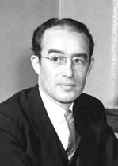
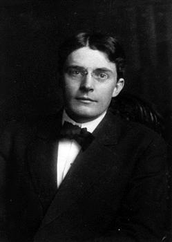
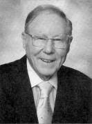

## 第5章 カウンセリングの諸理論
### 5-1 カウンセリング理論の歴史的位置づけ
1. 客観的：特性因子理論
2. 実証的：認知行動療法
3. 無意識：精神分析療法
4. 成長力：自己理論
5. 人は違う：人間学的アプローチ

### 5-2 特性因子理論―カウンセリングの夜明け
**ウィリアムソン**：心理アセスメント「学生のあらゆる可能性を引き出すための援助」（ミネソタ大の指示的療法）

### 5-3 認知行動療法（cognitive behavior therapy）行動療法、認知療法、論理療法（REBT）、認知行動療法
#### 5-3-1 行動療法から認知行動療法へ
##### 行動療法
- 学習理論を応用
- 学習のしなおしという観点
- 症状の消去または再学習
- 習慣化した行動パターンを変容することを目的とする

#### 5-3-2 古典的条件づけ（＝レスポンデント条件づけ）
##### a. 原理
パブロフ（ロシア）の犬の唾液腺「エサを見せるときとベルの音を近づける」（接近の法則）
##### b. 現場への応用
- →ウォルピ：逆制止法
- →**系統的脱感作法**：「段階的に」「感じすぎるのを弱める」不安階層表

##### c. 発展
**ワトソン**（アメリカ）と助手のレーナーによる白ネズミ実験：→除反応

#### 5-3-3 オペラント条件づけ
##### a . 原理
ソーンダイクの試行錯誤理論→**スキナー**のスキナー箱：ネズミの**行動**（スイッチ）→報酬（強化因子）＝**強化**の法則

##### b. 現場への応用
スーパーマーケットのクーポン券

##### c. 発展
処罰する：負の強化因子：嫌悪療法（？疑問？）

#### 5-3-4 古典的条件づけとオペラント条件づけの比較
|古典的条件づけ                      |オペラント条件づけ          |
|------------------------------------|----------------------------|
|反応で生じる                        |操作的な場面づくり          |
|刺激から反応へ                      |行動や反応から刺激へ        |
|近接の法則                          |**強化の法則**              |
|内蔵や血管などの**生理機能**を正常に|**生活習慣**を変えるのに有効|
##### 強化の法則はオペラント！（レスポンデントではない！）

#### 5-3-5 社会的学習理論
##### a. 原理
**バンデューラ**：他者の行動を観察し、それを模倣して学習し、認知や行動を変える。

##### b. 現場への応用
SST
##### c. 発展
アサーション・トレーニング（→ウォルピの行動療法）：非主張的行動・攻撃的行動・主張的行動

#### 5-3-6 論理療法（REBT法）
エリス：1955年理性療法（合理療法）→論理療法→1993年論理情動行動療法

#### 5-3-7 認知療法
ベック：「自動思考」と「スキーマ」
ソクラテス対話法（うまくいっているところを強調した質問法）

#### 5-3-8 認知行動療法への発展
1995年コペンハーゲン「認知行動療法」
刺激と反応の間に認知変数

### 5-4 精神分析療法（psychoanalytical therapy）交流分析、ゲシュタルト療法、精神分析療法
#### 5-4-1 精神分析の概観
フロイトによって始められた

##### a. 精神分析療法が成立するまで
1885年パリのシャルコー：ヒステリー症状に対する催眠術
1895年ブロイエル〔ブロイアー〕と共著『ヒステリーの研究』（催眠カタルシス法）：O. アンナ

##### b. 自由連想法と夢分析
###### 自由連想法：連想の飛躍・滞り→神経症の原因
###### 無意識層に隠されている欲求や願望は夢の中では意識層に向かって上昇を始める→前日記憶によって変形→夢作業（視覚化・移動・圧縮）→第二次工作（意識による）

##### c. その他の精神分析の治療原理
###### 1) 幼児期への退行
クライエントを幼児期へ退行させ、そこで無意識の欲求や願望の源泉を見つけ、それを意識化させることで治療を試みる。
###### 2) 転移抵抗の処理
転移が起きたら意識化させ、クライエントとともに考えていく。
###### 3)防衛機制の解釈
避ける・固執→どのような防衛原理が働いているか、解釈してたずねてみる。

##### d. 現代における精神分析の面接方法
##### 受理面接
大まかおおまかな訴えを聴く。その相談機関が扱うかどうか判断。
##### 導入期
**問題点を把握**。信頼関係の構築。
##### 深化期
支持的態度で、生活史・現病歴・対人関係・退行の程度・不満や葛藤の原因・転移や抵抗を克服
##### 展開期
解釈技法・直面化技法
##### 終結期
査定、依存を解消。

##### e. フロイトとその仲間たち
アドラーとユング

##### f. その後の精神分析の展開
#### 5-4-2 交流分析（transactional analysis : TA）
##### a. 交流分析の始まり
- 精神分析から発展した
- バーン「互いに影響を与えたり受けたりしている交流を分析する方法」
- パーソナリティおよび対応の要点がつかめ、図式化できるので自己理解や教育指導に使いやすい

##### b. 自我状態の分析
- P: Parent
    - CP: Controlling paternt
    - NP: Nurturing parent
- A: Adult
- C: Child
    - FC: Free child
    - AC: Adapted child

##### c. 交流パターン分析（やりとり分析）
- 相補的交流
- 交差的交流
- 裏面的交流

##### バーンの欲求理論
- ストローク：その人の存在や価値を認めるための言動や働きかけ
- 構造化への欲求：**基本的構え**（＝人生態度←幼少期の両親との関係を中心として培われる）と交流様式
    - You are OK I am OK

##### d. ゲーム分析
- ラケット感情：幼児期に獲得し慢性化した、現在の行動様式に強く影響している”不快な感情”である。幼少期にストロークを得る手段として身につけ、現在のゲームを支配している感情であり、普通、ゲームの結末で体験される。

##### e. 脚本分析

#### 5-4-3 ゲシュタルト療法（gestalt therapy）
##### a. ゲシュタルト療法とは
パールズ：「いま、ここで」の全体的な人格の統合性を回復。過去の体験のなかで未完に終わっている問題、「いま、ここ」の問題として再処理。**言語的・非言語的表現**に注目。
##### b. 役割交換法
##### c. エンプティ・チェア

### 5-5 人間学的アプローチ（humanistic psychotherapy）
#### 5-5-1 実存主義の哲学とは
#### 5-5-2 実存主義的カウンセリング
1. 個別性（uniqueness）
2. 主体性（subjectivity）
3. 自由性
4. 有限性（メメント・モリ）

ビンスワンガー（現存在分析）とフランクル：実存主義的質問法

マズローのヒューマニスティック心理学会←ロジャーズ

#### 5-5-3 実存分析（ロゴセラピー）
フランクルの実存分析（ロゴセラピー）

### 5-6 家族療法（family therapy）短期療法、ナラティヴセラピー
#### 5-6-1 家族療法とは
##### a. アッカーマンの家族療法
##### b. 家族システム論の原理
円環的因果関係
##### c. 家族システム論の発展
###### 1) 二重拘束性コミュニケーションからMRI研究所へ
MRIはベイトソン以外のメンバーが設立
###### 2) ボウエンの家族歴史論（多世代理論）
###### 3) ミニューチンの家族構造論
NYのスラム街。家族構造図。
###### 4) その後の家族療法の発展
#### 5-6-2 短期療法（brief therapy）
ミルウォーキー派のド・シェイザーとキム・バーグの解決志向短期療法（solution focused approach）
#### 5-6-3 ナラティヴセラピー
ホワイトとエプストン：問題の外在化

### 5-7 その他のカウンセリング理論
#### 5-7-1 現実療法（reality therapy）
**グラッサー**：(1)過去は問題にしない、(2)マイナスイメージをもった症状には焦点を合わせない、(3)人間関係に重点をあてる

#### 5-7-2 森田療法
森田正馬（もりたまさたけ；1874-1938）：森田神経質：ヒポコンドリー性気質：「あるがまま」を大切に、生活を向上させるよう面接指導、臥褥療法
#### 5-7-3 内観療法
吉本伊信（1916-1988）：生活習慣、神経症や心身症。「してもらったこと」「して返したこと」「迷惑をかけたこと」。

### 拾遺（平木本より）
#### グループ・アプローチ
- 小グループで行うカウンセリング、心理療法、人間関係訓練（トレーニング・グループ＝training group。Tグループと呼ばれることもある）などの総称で、**グループの状況におけるグループ独自の機能と特性を活用したアプローチ**
- メンバーの相互作用や話し合いを通して、自己理解、他者理解、人間関係理解、治療などが行われる。
- メンバーが体験することは、人間関係をつくっていくことの難しさとすばらしさであり、そこには1対1のカウンセリングでは得ることのできないダイナミックな人間関係の体験がある。

##### 個人に焦点をあてたもの
- 自然にできるグループのプロセスを重視する方法
- エンカウンター・グループ

##### 集団に焦点をあてたもの
- グループ・プロセスそのものを治療的に起こそうとする方法
- Tグループ

##### 自助グループ（セルフヘルプ・グループ）
一般の人々が身近な人から得る情報や支援の源として、また、専門家の働きを支えるサポート・システムとして、重要な役割を担っており、代表的なものにはAA（断酒会）、統合失調症の患者の家族がつくる「家族会」などがある。
