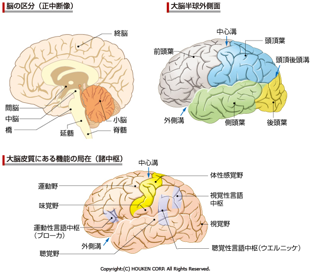
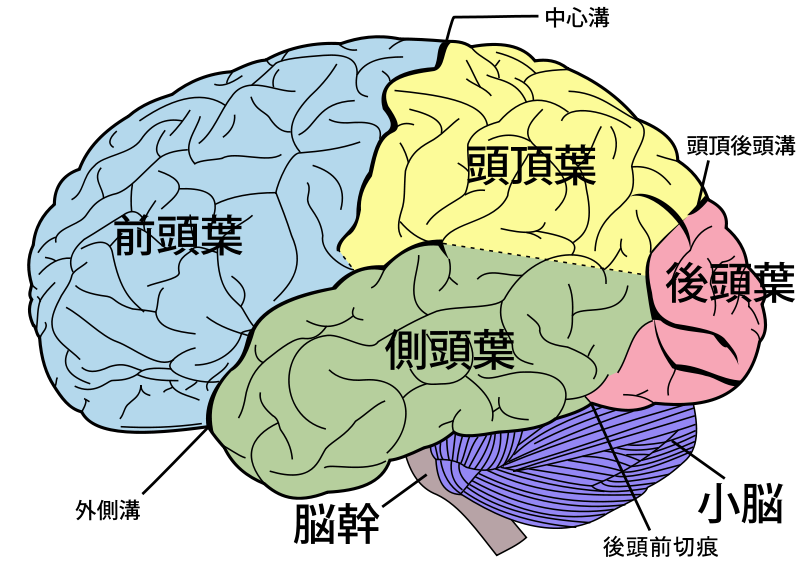

# 第6章 こころのメカニズム
## 6-1 人間の身体とこころ
### 6-1-1 生物的、心理的、社会的存在としての人間
### 6-1-2 生物的側面としての免疫系と内分泌系
人間は免疫系、内分泌系（ホルモン）、神経系の相互作用によってコントロールされているスーパーシステムである。免疫系・内分泌系・神経系の3つが密接な関係を持ちながら、生体の内部環境の安定（ホメオスターシス）に重要な役割を担っている。

#### a. 免疫系
免疫系は、「自己」と「非自己」を判別し、「非自己」が「自己」に侵入することから「自己」を防御している。この機能は白血球の仲間であるリンパ球（主にB細胞とT細胞）が担っている。ナチュラルキラー細胞（**NK細胞**）と呼ばれるリンパ球は、ウイルスに感染した組織や、がん細胞などを溶解することによって、人体を守っている。

**NK細胞は心理ストレス下で活性が減少する**ことが知られている。

#### b. 内分泌系
ホルモンは、内分泌腺などから分泌される情報伝達物質である。

### 6-1-3 神経系の基礎知識
#### a. 神経細胞の構造
神経系には2種類の細胞がある

1. 神経細胞（ニューロン）
2. 神経膠細胞（グリア細胞）

〔グリア細胞はかつては静的な機能しか持たないと思われていたが、現在では動的な機能ももつことが確認されてきている〕

すべての**神経細胞（ニューロン）**は

- 樹状突起（情報の受信）
- 細胞体
- 軸索（情報の送信）

の3つの部分からなる。

ニューロンとニューロンのつなぎ目を**シナプス**と呼び、ここには間隔（シナプス間隔）が開いている。興奮した神経細胞はその情報を軸索の終末に伝える。その終末には、セロトニン・ドーパミン・ノルアドレナリンなどの神経伝達物質を入れた**顆粒**があり、その顆粒がシナプス間隙に放出される。放出された神経伝達物質は、周囲の神経細胞の細胞膜にある受容体と結合し、その神経細胞を興奮させる。

#### b. 中枢神経系と末梢神経系（解剖学的特性）
神経系はその解剖学的特性から、**中枢神経系**（脳と脊髄）と**末梢神経系**に区別される。

脳は解剖学的には、

- 小脳
- 脳幹（延髄・橋・中脳）
- 間脳（視床・視床下部）
- 大脳（大脳基底核・大脳辺縁系・新皮質）

に区分される。

脳を機能的に分けると、次の3つの部分。

1. **脳幹と視床下部**：生得的
2. **大脳辺縁系**：内界と外的現実のバランスを維持する役目
3. **新皮質**：経験に影響を受ける。**意識の中枢**
    - 運動野（前頭葉）
    - 感覚野（体性感覚：頭頂葉、味覚：頭頂葉、聴覚：側頭葉、視覚：後頭葉）
    - 連合野（学習、記憶、情動、空間認知の機能。言語は、左半球の前頭葉と側頭葉）

#### c. 体性神経系と自律神経系
神経系はその機能的特性から**体性神経系**と**自律神経系**に分けることができる。

##### 体性神経系
- 感覚神経：求心性の末梢神経
- 運動神経：遠心性の末梢神経

##### 自律神経系
- 交感神経系
- 副交感神経系

キャノン（Cannon, W.）「闘争・逃避反応（the flight-or-fight response）」

### 6-1-4 こころの緊張と身体の緊張の循環
## 6-2 私たちは外界をどのように認知しているか
### 6-2-1 外界の知覚：視知覚を代表として
### 6-2-2 ゲシュタルト心理学の知見
- 刺激は個々の要素がばらばらに知覚されるのではなく、よいまとまりを持ったものとして認知される傾向を持つことを主張した。
- 多くの錯視図形を作り、知覚する世界が外界そのままの写しではないことを示した。
- 個々の要素よりも全体の構造のほうを重視する視点を強調する。
- 要素主義的傾向の強い行動主義の台頭によって影響力を減じた。
- 近年、行動を説明する際には、個人の特性と状況との相互作用を考慮する必要があるということが再認識されており、これはレヴィン（Lewin, K.）の公式の再評価ともいえる。

※注意：「ゲシュタルト療法」はパールズ

### 6-2-3 認知機能の特徴
### 6-2-4 認知的不協和理論（フェスティンガー）
- 不協和＝不一致
- 【基本仮説】不協和があるとその不協和を低減させようとする圧力がこころに起きる
- 行動を変えるのが困難な場合、認知のほうを行動に一致する方向へ変化させると予測しうる

### 6-2-5 自我の防衛機制
自我の4つの機能：

- 現実検討機能（A）
- 執行機能（G）
- 統合機能（I）
- 防衛機能（L）

#### 自我の防衛機制とは、現実をありのままに受けいれると自我が脅かされる可能性のあるときに、現実を歪曲したり、無視したり否定したりして、自我の都合のよいように受けいれる機能である。

#### 「抑圧」：自我を脅かすような現実から、目をそらすこと。
#### 「逃避」：目の前の現実とは違った別の現実、病気、空想などへの逃避がある。
#### 「置き換え」：怒られた子が弟を攻撃。
#### 「合理化」：自我に都合のよい理由を考え、”欲しいものも取れない不甲斐ない自分”に直面しないようにする。「すっぱい葡萄」
#### その他：「反動形成」：反対の傾向を強調することで抑圧を強化、「投射」：自分のものではなく他の人にあるかのように感じとる。

防衛機制を使うことによって自我を守ることができるが、行動がより不適応的になるという問題点がある。現実をありのままに受けいれられる人は、自我の強い人だけである。自我が弱ければ弱いほど、現実を歪めて自分に都合のよいように受け取っていると考えられる。

私たちが認知しているのは「ありのままの世界」ではなく、自我（自己）が「認知している世界」、または自我（自己）に「都合のよい世界」である。私たちは、他者がどのように感じ考えているか、現実の人間関係がどのようなあり方をしているかなどを正確に知ることはできない。

## 6-3 ストレスとレジリエンス
### 6-3-1 ストレスとレジリエンスとは
- 「ストレス」：外力による歪み
- 「レジリエンス」：外力による歪みを跳ね返す力

個人には、ストレスに対する脆弱性（ヴァルネラビリティ）と回復性（レジリエンス）がある。トラウマ的経験をしても重篤なPTSDを発症する人とそうでない人がいる。

### 6-3-2 レジリエントな人
レジリエントな人は、周囲の人からのサポートを持っている。パーソナリティの可塑性は高い。

## 6-4 正常・異常と適応・不適応
### 6-4-1 概念の検討
異常（abnormal）と不適応（maladjustment）

#### 正常・異常　ドイツ語圏
- 生得的・遺伝的要因
- 質的に異なる
- 人間の異なる2つのカテゴリー
- 質的に非連続

#### 適応・不適応　アメリカ
- 環境的要因
- 本質的な違いはなく連続的・程度の問題
- 本人自身の認知が重視される

異常や不適応を判別する3つの基準
##### a. 統計的基準
##### b. 価値的基準
##### c. 病理的基準

### 6-4-2 精神障害とは
### 6-4-3 精神障害という用語の基礎
精神医学的には精神障害は次のように捉えられている：

1. 何らかの障害があり、本人または周囲の人がその障害があるために苦しんでおり、治療することが望ましいと判断される。
2. 分類されるのは障害（症状）であって、人間ではない。
3. 障害を分類するのは、障害の理解と治療に役立てるためである。
4. 同じ障害と診断される人であっても、その障害以外の部分は異なっており、健康な部分も多くある。

## 6-5 まとめ
