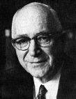
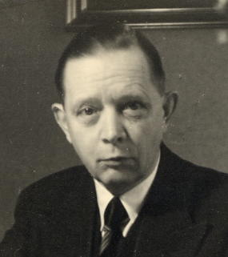
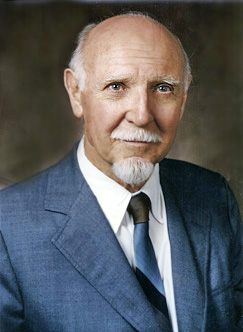

# 第7章 パーソナリティの理論
## 7-1 パーソナリティとは何を意味している言葉か？
### 7-1-1 その意味と定義
- パーソナリティという用語は「人格」と訳され、こころの動き方の個性や個人差を意味する用語である。ほぼ同義の言葉に「性格」がある。キャラクターの語源はギリシャ語で、「刻み込むこと」や「彫刻」という意味を含んでいる。この用語は、第2次世界大戦以前のドイツ語圏で心理学がさかんであった頃によく用いられ、遺伝的・生得的に規定されており変化しにくいというニュアンスがある。これに対して、パーソナリティの語源はラテン語のペルソナで、仮面、俳優が演ずる役割、そして演ずる人を意味していた。パーソナリティという用語は、心理学の中心がアメリカに移り、さかんになるにつれてよく用いられるようになった。人格という用語には、後天的・学習的に獲得されるもので、環境要因が重要であり、変化しうるものというニュアンスがある。
- **個性**とか**個人差**とは、こころの動き方のその人固有の特徴である。
- **こころの動き方の特徴**とは、端的にいえばパターン化されている思考や行動のことである。
- ある個人はくり返し同じようなことを考え、同じような行動をしているがゆえに、他者と判別できるのである。
- パターンを生み出す何らかの**構造が個人の中にあると考える立場（実体論）**と、それは個人の外にあると考える立場（**状況論**）がある。
- 現在の人格心理学では前者（実体論）が主流。
- オールポート（Allport, G. W.）の定義「パーソナリティとは精神身体的組織をもった個人内の力動的体制であって、彼の特徴をあらわす行動と思考とを決定するものである」

### 7-1-2 パターンを生み出すものとは？：遺伝と環境をめぐって
## 7-2 パーソナリティ理論とは
### 7-2-1 精神分析的パーソナリティ理論
#### フロイト
##### 人格構造論＝心的装置論
- エス
- 自我
- 超自我

### 7-2-2 行動主義的パーソナリティ理論
行動には、無学習性（本能的、生得的）のものと学習性のものがある。人間ではほとんどが学習性。

#### 学習
学習は「レスポンデント条件づけ」（→5-3-2：パブロフ、ウォルピ、ワトソン）「オペラント条件づけ」（→5-3-3：スキナー）「モデリング」（→5-3-5：バンデューラ、ウォルピ）でなされる。

##### レスポンデント条件づけ（古典的条件づけ）
##### オペラント条件づけ（道具的条件づけ）
##### モデリング
バンデューラ「観察だけで十分学習する、罰の観察は有意に低減させる」

### 7-2-3 現象学的パーソナリティ理論（現象学的自己理論）
ロジャーズ：世界を意味づける枠組み（内部的照合枠）とは「自己概念」である。2つの形成過程がある。経験に即して形成されたものと、他から与えられて内在化されたもの。**経験に即した自己概念が多くあり、経験をありのままに受け入れることのできるパーソナリティ構造が適応的**。

人間は自己概念という枠組みを通してしか、自己実現傾向を発揮することができない。

### 7-2-4 家族システム論におけるパーソナリティ
### 7-2-5 類型論、特性論
#### 類型論（typology）
- 人間をそれぞれ独立したカテゴリーであるいくつかの類型に分類できる

##### 類型
- クレッチマー（Kretschmer, E.）：細長型―分裂気質、肥満型―躁うつ気質、闘士型―粘着気質（クレッチマーは肥満）
- シェルドン（Sheldon, W.H.）：体格と気質との関係を対応づけた胚葉起源説（『心理学』217、『問題集』58-D）。消化器系統の発達が顕著な内胚葉型（肥満型）【内臓緊張型】、筋肉・骨格系統の発達が顕著な中胚葉型（筋肉型）【身体緊張型】、神経系統の発達が顕著な外胚葉型（やせ型）【頭脳緊張型】。
- ユング（Jung, C.G.）：〈内向型―外向型〉×（〈思考―感情〉×〈感覚―直観〉）＝8類型

#### 特性論（trait theory）
- 人間のパーソナリティには共通したいくつかの特性次元があり、その程度の組み合わせによって理解できる

##### 特性（trait）
- 特性という概念をはじめて用いたのはオルポート（Allport, G. W.）。（『心理学』220、『問題集』58-D）
- アイゼンク（Eysenck, H. J.）：向性（外向的―内向的）・神経症傾向（安定―不安定）に加えて、精神病質傾向：→向性と神経症傾向（情動性）はもっとも安定した2因子→ビッグファイブ
- キャテル（Cattell, R. B.）：〈躁うつ気質―分裂気質〉〈情緒安定性―神経症的情緒不安定性〉〈積極的性格―消極的性格〉など**12特性**（キャテルは12人（結晶性知能と流動性知能））
- Big-five（5因子モデル）：e.g. コスタとマックレー（Costa & McCrae）：神経症的傾向(**N**euroticism)・外向性(**E**xtraversion)・経験への開放性(**O**penness)・調和性(**A**greeableness)・誠実性(**C**onscientiousness)

## 7-3 パーソナリティの発達と変化
### 7-3-1 乳幼児期
#### a. 乳児の気質
##### トーマスとチェス（Thomas, A. & Chess, S.）
- 環境に対する反応の仕方に個人差がある
- 9つの特質（生得的ではあるが、遺伝的ではない〔問題集59-1〕）
    1. 活動水準
    2. 周期性（規則性）
    3. 接近・回避
    4. 順応性（適応性）
    5. 機嫌（気分）
    6. 閾値（反応する刺激の強さ）
    7. 強度（反応の程度）
    8. 気の散りやすさ
    9. 注意の幅・持続性
- 子どものパーソナリティは、このような生得的な気質と生後の人間関係を中心とした環境との絶え間のない相互作用によって形成されると考えられる（※変化しにくくない〔問題集59-2〕）。

#### b. 愛着の形成
##### ボールビー（Bowlby, J.）
- 人間の赤ちゃんには**生得的に**母親に接近しようとする行動（**接近行動**）と、母親を呼び出そうとする行動（**信号行動**）が**備わっている**と考えた（※習得するのではない〔問題集59-3〕）。

##### エインズワース（Ainsworth, M.D.）
- ストレンジ・シチュエーション法
    1. 安定型
    2. 回避型
    3. アンビバレント型
    4. 無秩序型（病理的）
- 出現頻度は社会・文化によって大きく異なる。
- 愛着形成のプロセスのなかで**内的活動モデル**が形作られる。
    - 自己と他者そしてこの世界に対する仮説
    - 愛着形成は内的作業モデルを媒介にして、新たに形成される人間関係のモデルになる。

### 7-3-2 児童期から青年期へ
#### a. 自己意識の発達
#### b. 自我同一性の獲得
##### エリクソン（Erikson, E. H.）
- 青年期の終わりは自我同一性の獲得による
- 「成年期の終わりに確固たるアイデンティティが発達していなければ、次の段階へと発達していくことができない」

e.g. [Erikson's stages of psychosocial development](http://en.wikipedia.org/wiki/Erikson%27s_stages_of_psychosocial_development "エリクソンの心理社会的発達")

|年齢 |   段階   |   徳   |     心理的課題    |          |
|-----|----------|--------|-------------------|----------|
| 0- 1|    乳児期|  希望  |基本的信頼 vs. 不信|          |
| 2- 4|  幼児前期|  意志  |自律 vs.恥と疑い   |          |
| 4- 5|  幼児後期|  目的  |自発性 vs. 罪      |          |
| 5-12|    児童期| 有能感 |勤勉 vs. 劣等感    |          |
|13-19|    青年期| 忠誠心 |同一性 vs. 役割混乱| 職業選択 |
|20-39|初期成年期|   愛   |親密性 vs. 孤立    |配偶者選択|
|40-64|    成年期|  世話  |生殖 vs. 停滞      |          |
|65-死|    成熟期|  賢さ  |自己統合 vs. 絶望  |          |

##### マーシャ（Marcia, J.）
大学生の自我同一性の地位（状態）を半構造化面接法で検討。(1)危機の経験の有無、(2)コミットメント（傾倒）の有無を基準として4つの地位を見出した

- **同一性達成（A）**：やりたいことや自分の能力などについて悩み、今はある職業に就こうと意志決定をし、そのための努力をしている
- **モラトリアム（M）**：意志決定をしようと模索しており、悩み考えている。選択肢のなかで試行錯誤している
- **早期完了（F）**：自己をめぐる危機を経験したことがないが傾倒だけはしている
- **同一性拡散（D）**：アルバイトはできるが本当の職業は選べない

### 7-3-3 成人期から老人期へ
#### a. 成人期の課題
##### エリクソン
- は、青年期の課題を**自我同一性の獲得**と**職業選択**、
- 成人期前期の課題を**親密性の獲得**と**配偶者選択**とした。

#### b. 中年期の危機
- 中年期の自殺の動機としては、病気や仕事上での悩み、サラ金返済苦などの経済問題、配偶者との離婚など（『問題集』60-A）。

##### ユング
- ライフサイクルの心理学的研究
- **中年期の転換期が人生最大の危機の時期**
    - 人生の午後
    - 個性化の時期：自己に対する真剣な考察を捧げ、人生の前半で排除してきた自己を見つめ、自己のなかに取り入れること。

##### レヴィンソン（Levinson, D. J.）
- 男性の場合は40歳頃から「人生半ばの過渡期」が始まる
    - **中年の危機**：漠然とした人生への幻滅感、停滞感、圧迫感、焦燥感等を主徴とする中年期特有の心理状態。（『問題集』60-D）
    - 正常な中年の80％が「中年の危機」を体験する。

#### c. 老年期のパーソナリティと課題