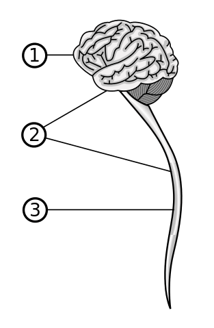

# 第10章 職場のメンタルヘルス・ケア
## 10-1 労働者のメンタルヘルスに関する事業者の法的責任
主な法律：

1. 労働契約法
2. 労働基準法
3. 労働者災害補償保険法
4. 労働安全衛生法

### 10-1-1 労働契約法と安全配慮義務
#### 安全配慮義務
1975年：最高裁判所の判決（陸上自衛隊八戸車両整備工場事件）

- 事業者が労働者に負っている**労働契約上の債務**で、事業者が労働者に対し、事業遂行のために設置すべき場所、施設もしくは設備などの施設管理または労務の管理にあたって、労働者の生命および健康などを危険から保護するよう配慮すべき義務

2000年：最高裁判所の判決（電通事件）

- **使用者は**、業務の遂行に伴う疲労や心理的負荷等が過度に蓄積して労働者の心身の健康を損なうことがないよう注意する義務を負う
- 使用者にかわって労働者に対し業務上の**指揮監督を行う権限を有する者**に、使用者の注意義務の内容に従って、その権限を行使することを求めた
- **民事訴訟**では、業務と健康障害の間に**相当因果関係**が認められること（＝**予見可能性**があることの前提）、健康障害を起こさないための具体的な方法が存在すること（＝**回避可能性**があること）、**故意もしくは過失があること**が**損害賠償を認定する要件**とされている
- →**管理監督者**が、労働者の健康状態を把握し、健康状態に問題がある場合には業務負荷による健康状態の増悪を防ぐための具体的な措置をとることが必要となった
- 損害賠償請求訴訟においては、業務に直接起因する健康障害のみでなく、業務と密接な関連を有する健康障害を起こさないように配慮することが民事上の事業者責任に含まれることになった

#### [労働契約法](http://law.e-gov.go.jp/htmldata/H19/H19HO128.html)
2007（平成19）年制定

- 第5条：使用者は、労働契約に伴い、労働者がその生命、身体等の安全を確保しつつ労働することができるよう、必要な配慮をするものとする

2008（平成20）年施行

- 使用者と労働者の間に**労働契約が成立した時点で**、法制度上、使用者が労働者に対して**安全配慮義務**を負うこととなった
- 民法第**415**条**債務不履行による損害賠償**→「債務不履行」（良い子が債務不履行）
- 民法第**709**条**不法行為による損害賠償**→「注意義務違反」（成金が注意義務違反）
- 民法第**715**条**使用者等の責任**→「使用者等の責任」（民法に内含される使用者責任）

### 10-1-2 労働災害補償と労働基準法・労働者災害補償保険法
#### [労働基準法](http://law.e-gov.go.jp/htmldata/S22/S22HO049.html)（1947＝昭和22年）
- 第8章：**災害保障の規定**：労働者が業務上負傷し、疾病にかかった場合、事業者は支払わなければならない：
    - 療養補償
    - 休業補償
    - 障害補償
    - 遺族補償
    - 葬祭料
- これらは無過失賠償責任
- 労働基準法施行規則第35条：業務上の疾病の範囲

#### [労働者災害補償保険法](http://law.e-gov.go.jp/htmldata/S22/S22HO050.html)（1947＝昭和22年）
- 労働基準法では、倒産したときに補償を受けられないという問題を解消するために制定。
- 労働基準法第84条：**労災保険による給付を受けたものに対しては、使用者は労働基準法で定められた災害補償をしなくてもよい**
- 労災保険は**政府が直接管掌**し、**事業主が保険金を負担**する仕組みになっており、労働者の経済的負担はない
- 労災の申請は、健康被害を受けた労働者自身、もしくはその遺族が**所轄の労働基準監督署長**に対して行う
- **業務上外の決定をする権限は監督署長**にある
- この**判断の基準は、業務遂行性と業務起因性**が確認できること
    - **業務遂行性**：労働者が労働契約に基づいて事業者の支配管理下にある状態であること
    - **業務起因性**：業務と健康障害の間に相当因果関係があること
- 民事の損害賠償と異なり、過失の有無は問題にならない

- 1999年労働基準局長通達：→それまでは原則として業務外と判断されていた、メンタルヘルス不調およびその症状としての自殺について、一定の要件を満たすものは業務上と認めるという大きな方針転換を指示した
    1. 「心理的負荷による精神障害等に係る業務上外の判断指針について」→2011年廃止
    2. 「精神障害による自殺の取扱いについて」
- 2011年：[「心理的負荷による精神障害の認定基準について」](http://www.mhlw.go.jp/stf/houdou/2r9852000001z3zj-att/2r9852000001z43h.pdf)
    - 別表1「業務による心理的負荷評価表」：心理的負荷として「特別な出来事」4項目
    - 「発病直前の1ヶ月におおむね160時間を超えるような時間外労働を行った場合」（特別な出来事の4）
        1. 対象疾病：心身症は含まれない
        2. 認定要件
            1. 対象疾病を発病していること。
            2. 対象疾病の発病前おおむね6か月の間に、業務による強い心理的負荷が認められること。
            3. **業務以外の心理的負荷**及び**個体側要因**により対象疾病を発病したとは認められないこと。
        3. 認定要件に関する基本的な考え方
            - 「ストレス－脆弱性理論」に依拠する。
        4. 認定要件の具体的判断
        5. 精神障害の悪化の業務起因性
        6. 専門家意見と認定要件の判断
        7. 療養及び治ゆ
        8. その他

### 10-1-3 労働安全衛生法
#### 労働安全衛生法
1972年：労働基準法から分離

- 労働基準法第42条「労働者の安全及び健康に関しては労働安全衛生法の定めるところによる」
- **安全衛生管理体制**の整備を義務づける
- 事業者はこの体制の構成員として**衛生管理者**、産業医などを専任し、衛生管理者に、産業医の指導・助言のもとで衛生にかかる技術的事項を担当させなければならない（常時50人以上の労働者を使用する事業場の場合）
    - **衛生管理者：労働安全衛生法で定められた国家免許所有者**
- 事業者は、衛生管理者が労働安全衛生法の趣旨に沿った活動を行うために必要な権限を与えなければならない
- 常時50人以上の労働者を使用する事業場には、**調査審議機関**として**衛生委員会**の設置が義務づけられる
    - 衛生委員会：**衛生管理者、産業医**はその必須の構成員
    - 衛生委員会への付議事項は11項目（労働安全衛生規則第22条）
- 事業者には、労働衛生管理体制を活用して**労働衛生の3管理**と**労働衛生教育**を実施することも義務づけられる
    1. 作業環境管理
    2. 作業管理
    3. 健康管理

#### a.健康診断とその事後措置
- 労働安全衛生法で定められた健康診断：
    - 一般健康診断
    - 労働局長の臨時の指示による健康診断
    - 特殊健康診断
- 就業上の措置[「健康診断結果に基づき事業者が講ずべき措置に関する指針」](http://akita-roudoukyoku.jsite.mhlw.go.jp/library/akita-roudoukyoku/seido/anzen/sisin220119.pdf)（労働安全衛生法第66条の5の規定）

#### b.健康教育
- [労働安全衛生法](http://law.e-gov.go.jp/htmldata/S47/S47HO057.html#1000000000007000000000000000000000000000000000000000000000000000000000000000000)：第69条「事業者は、労働者に対する健康教育及び健康相談その他労働者の健康の保持増進を図るため必要な措置を継続的かつ計画的に講ずるよう努めなければならない」（←1988（昭和63）年改正で新設）
- [「事業場における労働者の健康保持増進のための指針」](http://www.mhlw.go.jp/bunya/roudoukijun/anzeneisei12/pdf/10.pdf)（平成19年＝2007年公示）→[**トータル・ヘルスプロモーション・プラン**（THP）](https://www.jisha.or.jp/health/thp/)
- 6人の専門スタッフが担当組織：産業医・運動指導担当者・運動実践担当者・心理相談担当者・保健指導担当者・栄養指導担当者（問題集5-B）
- 健康測定
- →健康指導
    - 運動指導
    - 保健指導
    - 栄養指導
    - 心理相談
- メンタルヘルスケアが必要と判断された場合または労働者自身が希望する場合に、**産業医もしくはそれに代わる医師の指示のもとに心理相談担当者が**メンタルヘルスケアを行う。
- THPは積極的な健康づくりを目指す人が主たる対象（※メンタルヘルス不調者は産業医もしくは医師の仕事）

#### c.快適な職場環境の形成
- 労働安全衛生法第7章の2の表題**「快適な職場環境の形成のための措置」**
- 第71条の2「事業者は、事業場における安全衛生の水準の向上を図るため、次の措置を継続的かつ計画的に講ずることにより、快適な職場環境を形成するように努めなければならない」
- 「事業者が講ずべき快適な職場環境形成のための措置に関する指針」（労働省告示平成9年＝1997年）

|作業環境|職場環境|
|--------|--------|
|物理的・化学的・生物学的な状況。原則として客観的で再現性のある方法で測定することができる。|作業環境・作業内容・作業方法・作業時間・作業密度・作業チームの人員構成、チーム内の人間関係・チームの活動性の高さ・作業の自律性の程度・職場の雰囲気。賃金・労働時間などの労働条件や福利厚生活動状況。客観的に測定ができる要素と主観的にしか把握できない要素が混在。|

#### d.「労働者の心の健康の保持増進のための指針」
- 厚生労働省：2006（平成18）年：労働安全衛生法第70条の2第1項の規定に基づく指針「労働者の心の健康の保持増進のための指針」

## 10-2 「労働者の心の健康の保持増進のための指針」
1. 趣旨
2. メンタルヘルスケアの基本的考え方
    1. 心の健康問題の特性
    2. 労働者の個人情報の保護への配慮
    3. 人事労務管理との連携
    4. 家庭・個人生活等の職場以外の問題
3. 衛生委員会等における調査審議
4. 心の健康づくり計画
5. 4つのメンタルヘルスケアの推進
    1. セルフケア
    2. ラインによるケア
    3. 事業場内産業保健スタッフ等によるケア
    4. 事業場外資源によるケア
6. メンタルヘルスケアの具体的進め方
    1. メンタルヘルスケアを推進するための教育研修・情報提供
    2. 職場環境等の把握と改善
    3. メンタルヘルス不調への気づきと対応
    4. 職場復帰における支援
7. メンタルヘルスに関する個人情報の保護への配慮
    1. 労働者の同意
    2. 事業場内産業保健スタッフによる情報の加工
    3. 健康情報の取扱いに関する事業場内における取り決め
8. 小規模事業場におけるメンタルヘルスケアの取組みの留意事項
9. 定義

2-1：**心の健康問題の特性**：心の問題の客観的な測定方法が確立していないためその評価が容易でないこと、心の健康問題の発生過程は個人差が大きいためそのプロセスの把握が難しいこと、すべての労働者が心の問題を抱える可能性があること、心の健康問題を抱える労働者に対して**健康問題以外の観点から評価**が行われる傾向が強いこと、心の健康問題自体についての誤解や偏見があること

健康問題以外の観点からの評価の例：怠けている、甘えている、協調性に欠ける、能力がないなど

2-4：家庭・個人生活等の職場以外の問題が存在する可能性があること

see.：10-1-1：労働契約法で事業者に課された**安全配慮義務**の実行責任は**管理監督者**にある

## 10-3 過重労働対策とメンタルヘルス
労働安全衛生法上の事業者の義務：

1. **厚生労働省令で定める要件に該当する労働者**に対して**医師による面接指導**を行うこと、その記録を残すこと、面接結果に基づく就業上の措置につき医師の意見を聴くこと、必要がある場合には就業上の措置を講ずること、医師の意見を衛生委員会などに報告すること（第66条の8）
2. 1.には該当しないが健康上の配慮が必要なものに対して、1.もしくは1.に準ずる措置を行うよう努めること（第66条の9）

- 面接指導の対象：**労働基準法第32条第1項の規定**である週40時間（休憩時間は除く）を超えて働かせた場合における超過時間が月100時間を超え、かつ疲労の蓄積が認められる者（労働安全衛生法規則第52条の2第1項）
- 面接時間：その者の申し出によって始まる（第52条の3第1項）
- 労働基準法第41条第2号では、「監督もしくは管理の地位にある者または機密の事務を取り扱う者」には、同法第32条の労働時間に関する規定を適用しないと定められているが、**管理監督者**も労働基準法上は労働者であり、医師による面接の対象となるので、事業者は、これらの社員についても、就業時間を把握する必要がある。
- 2001（平成13）年「労働時間の適正な把握のために事業者が講ずべき措置に関する基準について」でも、すべての**管理監督者について**労働時間を把握するよう求めている。
- 産業医面接の確認事項：労働安全衛生規則第52条の4
- 2006（平成18）年労働基準局長通達「過重労働による健康障害防止のための総合対策について」

## 10-4 職場におけるメンタルヘルス対策
- 職場のメンタルヘルス活動が十分な成果をあげるためには、専門スタッフの確保だけではなく、産業カウンセラーも関わりながら、職場内システムとしてのしくみづくりを進めることが大切である。それら専門家がスタッフとして組織化されること、全社的な取り組みと風土づくりが必要である。（問題集6-C）
- ポイントは、「全社員を対象とした対応」と「メンタルヘルス不調者への対応」を同時に平行して行える体制を企業内につくり、それを動かすことである。
1. 全社員への対応
    1. メンタルヘルス教育
    2. メンタルヘルス相談
    3. 職場環境の快適化
2. メンタルヘルス不調者への対応
    1. メンタルヘルス不調者の把握
    2. 診療の場の設定
    3. 職場復帰

労働者の健康対策の核：

1. 労働者が、「自分の健康は自分で守る」というセルフケアの考え方を理解し、それを実践すること。
2. 事業者が、労働に直接起因する健康障害だけでなく、労働と密接な関係がある健康障害を起こさないようにするため、管理監督者によるケア（ラインによるケア）を推進すること。
    - 組織介入では、トップに問題意識をもってもらうことが重要なので、そのためには組織存続の危機になることさえあると強調することも必要である。（問題集5-D）
    - メンタルヘルスケアシステムを企業組織に組み込むために最も重要なことは、組織の構成員の共通認識をつくりあげることである。（問題集5-E）

### 10-4-1 セルフケア
### 10-4-2 ラインによるケア
1. 職場環境の快適化に取り組む：**職場におけるストレス対策の中核**：管理監督者が推進役：労働安全衛生法で定められた事業者の努力義務
2. 管理監督者が「いつもと違う部下」に早く気づくこと：通常の労務対策を行う前に、病気によるものではないことを確認しておく：異常性に有無の判断を管理監督者に求めることは適切ではない（産業医・医師の役割）
    1. 「いつもと違う」部下に、「いつもと違うけどどうした」と問いかける。
    2. 話をしてくれるならそれを聴く。必要があれば産業医につなぐ。
    3. 「何でもない」といって話をしてくれないときには、「そうか」といって話を打ち切り、10～14日状態の変化を観察する。
    4. 状態が元に戻らない場合は再度声かけする。話をしてくれるならそれを聴く。
    5. 話をしてくれない場合には、これは会社の約束事だからと説明して、産業医のところへ行くように指示する。
    6. 産業医のところへは行きたくないという場合は、必ず、これが会社の約束事なのでと告げて、管理監督者が産業医のところへ行く。

### 10-4-3 メンタルヘルス相談
- メンタルヘルス相談：何らかのこころの問題をもった人が、自分自身でそれを解決していく、その過程を、その人の依頼に基づき支援すること。
- 担当者の資質：
1. 来談者を傾聴し支持することで対応可能なもの
2. 来談者のこころに介入し、何らかの（心理的）操作をしなければ対応できないもの
    - a)カウンセリングによる対応で可能なもの
    - b)精神医学的、心身医学的な対応が可能なもの

管理監督者の役割、産業医、保健師・看護師、衛生管理者など事業場内産業保健スタッフの**役割と守備範囲を明確に**し、不足するヒューマン・リソースを**事業場内で確保するのか、事業場外資源を活用するのか**などを事業場の実態にあわせて決める。

### 10-4-4 メンタルヘルス教育
- **管理監督者が話をじっくりと聴けるようになる**ためのカリキュラムを入れる必要がある。
- **事業者の**メンタルヘルスに関する基本認識と、ラインによるケアを推進する上での**管理監督者の**役割を明らかにしておくこと。
- 組織介入の中心が、長期間にわたる管理職（課長と係長）に対するメンタルヘルス教育であることもある。（問題集5-C）

## 10-5 職場復帰
### 10-5-1 職場復帰の考え方
職場復帰で大切なのは：

1. 通勤が安全にできること
2. 命じられた業務を遂行できること
3. 通勤や業務の負荷によって、健康上の問題が再度起こらないこと

職場復帰に関する判断をするには：

1. 労働者の職場復帰への意志の確認
2. 主治医による病気の回復状況および職場復帰可能性の判断
3. 産業医もしくはそれに代わる医師による職場復帰可能性および就業上の措置の必要性の有無の判断、必要な場合はその内容の提示
4. 復帰部署の状況把握

メンタルヘルス不調の場合は、**病状回復の程度**を、本人や家族からの聴き取り、診察時の表情、話し方、態度、反応などの観察によって得られる情報に基づいて判断するため、医師による判断にばらつきが生じやすい。

### 10-5-2 「心の健康問題により休業した労働者の職場復帰支援の手引き」

- 元の部署に戻すことが原則

### 10-5-3 職場復帰者への配慮
管理監督者が知っておくべき職場復帰者への配慮事項：

1. 特別な理由がないかぎり元の職場に戻す。
2. 他の部下と同様に処遇し、特別扱いをしない。
3. 作業内容は元の仕事に比較して単純なものを労働時間に見合った量だけ与える。納期の厳しい作業は避ける。
4. 復職者の心理状態には波があるので、良好な状態、低下した状態、平均的な状態に区分し、それぞれのレベルと持続時間を総合して回復状況を把握する。
5. 順調に回復しているようにみえる場合でも、3～6か月後に再燃することがある。
6. 長時間にわたる定期的な通院が必要な者が多いが、「通院することはよいことだ」と支持する。
7. 医師から出されている薬をのむことに対する否定的な発言をしない。

## 10-6 職場における自殺対策
- 1998年に自殺者が急増し30,000人を超えた。その後、2011年までの14年間、30,000人を超える状態が続いている。（10～13年まで4年連続減少）
- **労働者災害補償保険法**で業務上の自殺と認定された労働者数については2011年は66人であり、減少傾向は見られない。

|1998|1999|2000|2001|2002|2003|2004|2005|2006|2007|2008|2009|2010|2011|
|----|----|----|----|----|----|----|----|----|----|----|----|----|----|
|   3|  11|  19|  31|  43|  40|  45|  42|  66|  81|  66|  63|  65|  66|

- 2006（平成18）年：**自殺対策基本法**：第5条**「事業主は、国及び地方公共団体が実施する自殺対策に協力するとともに、その雇用する労働者の心の健康の保持を図るため必要な措置を講ずるよう努めるものとする」**
- ※[労働者災害補償保険法](http://law.e-gov.go.jp/htmldata/S22/S22HO050.html)には「自殺」という単語は出てこない。

### 10-6-1 職場における自殺の実態と自殺対策の方向性
職場では、自殺対策そのものを前面に出して何かを行っても、成果はほとんど期待できない。**メンタルヘルス対策を根気よく継続すること**が自殺対策につながり、それが自殺対策としてもっとも有効であるという認識を共有することが必要である。

### 10-6-2 自殺の予兆
- 2001年厚生労働省「職場における自殺の予防と対策」（2007年改定）
- 「自殺予防の10箇条」
    1. うつ病の症状に気をつける
        - **うつ病を早い段階で見出し治療をすることが自殺予防につながる**
    2. 原因不明の身体の不調が長引く
    3. 酒量が増す
    4. 安全や健康が保てない
    5. 仕事の負担が急に増える、大きな失敗をする、職を失う
    6. 職場や家庭でサポートが得られない
    7. 本人にとって価値あるものを失う
    8. 重症の身体の病気にかかる
    9. 自殺を口にする
    10. 自殺未遂に及ぶ

#### 「死にたいのはうつ状態の症状だ」という知識がないために起こる「自殺」はゼロにしたい
- 自殺念慮を自覚した場合には、うつ状態の有無を自己チェックしましょう。
    - 睡眠障害
    - 食欲低下
    - 頭の回転の低下
    - 今まで楽しかったことに楽しみを感じない
- この4症状がそろっていれば、うつ状態である可能性が高い

### 10-6-3 自殺について相談された場合の対応
## 10-7 守秘義務、プライバシーの保護、個人情報管理
「守秘義務」「プライバシーの保護」「個人情報管理」は相互に重なる部分はあるが、内容はそれぞれ異なる。

### 10-7-1 守秘義務
- 業務上あるいは職務上知りえた秘密を他に漏らさないようにすること
- [刑法](http://law.e-gov.go.jp/htmldata/M40/M40HO045.html)134条「秘密漏示」（第13章「秘密を侵す罪」）（日差しを浴びる秘密）
    1. 医師・薬剤師・医薬品販売業者・助産師・弁護士・公証人
    2. 宗教・祈祷・祭祀
- 保健師・看護師は対象外
- [労働安全衛生法](http://law.e-gov.go.jp/htmldata/S47/S47HO057.html)（1972＝昭和47年）第104条「健康診断等に関する秘密の保持」（邪心のある健康診断）
    - 健康診断並びに**面接指導の実施の事務**に従事した者は、その実施に関して知り得た労働者の秘密を漏らしてはならない
- **労働契約や委任契約**などを締結した当事者がこれらの契約に基づいて負う民事上の守秘義務
- [「産業カウンセラー倫理綱領」](http://www.counselor.or.jp/about/tabid/107/Default.aspx)第6条第3項「産業カウンセラーは、クライエントおよび他の専門職、企業・団体などの関係者との信頼関係確立のため、職務上知ることのできた秘密を正当な理由なく漏らしてはならない」
    - 法令上の義務ではなく、契約上の義務である

### 10-7-2 プライバシーの保護
### 10-7-3 個人情報管理
#### 2003（平成15）年[「個人情報の保護に関する法律（個人情報保護法）」](http://law.e-gov.go.jp/htmldata/H15/H15HO057.html)成立、2005（平成17）年施行
**個人情報**：

- 個人の識別が可能な生存者の情報。
- 匿名化された情報や死亡者の情報は対象とならない。
- ただし、健康情報に関しては、識別可能な死亡者の情報も生存者と同様に扱うことが推奨されている。
- 情報の収集・管理・使用に際し本人の同意を得ることを重視し、個人情報管理の透明性の確保と管理への各個人の積極的な関与を求めている。

## 10-8 ストレス
### 10-8-1 ホメオスターシス
### 10-8-2 ストレス
- 外界からの刺激：**ストレス要因**（ストレッサー）→生体の内部環境を変化させる方向に働く
- 生体がホメオスターシス（恒常性）を維持しようとする反応：**ストレス反応**　
- **セリエ**（Selye, H.）が見出した非特異的反応：
    1. 胸腺の萎縮
    2. 副腎の肥大
    3. 胃潰瘍
- 非特異的反応の時間的プロセス：
    1. 警告反応期
    2. 抵抗期
    3. 疲弊期

### 10-8-3 ストレスのメカニズム
視床下部（**H**ypothalamus）の興奮は２つの経路で抹消の臓器に伝えられる：

1. 自律神経系を介した経路
     1. 視床下部の興奮は交感神経系を刺激し、交感神経の終末からノルアドレナリンが放出される
     2. この刺激が腎臓の真上に位置している、副腎に伝わり、
     3. 髄質から**ノルアドレナリンとアドレナリンが血中に分泌**される
     4. この状態が長時間続くと副交感神経とのバランスが崩れるので、血中のノルアドレナリンとアドレナリンが増えると視床下部にフィードバックがかかり、交感神経系の興奮が抑制される。
2. HPA軸（HPA系）
    1. 視床下部：コルチコトロピン放出ホルモン（CRH）→下垂体を刺激
    2. 下垂体（**P**ituitary gland）：βエンドルフィン・副腎皮質刺激ホルモン（ACTH）→副腎皮質を刺激
    3. 副腎皮質（**A**drenal cortex）：糖質コルチコイド（副腎皮質ホルモン）→
        1. 肝臓における糖新生を促す
        2. ノルアドレナリンとアドレナリンの作用を**増強**して、心収縮力の増加と**血圧の上昇**をもたらす
        3. 胃酸分泌を増加させる
        4. 炎症やアレルギー症状を緩和する
    4. 副腎皮質ホルモンが長時間作用すると、
        1. 免疫力を低下させ、血糖値を上昇させる。
        2. 白血球の仲間であるリンパ球の活動を抑制するため、全身の免疫機能が低下する。
        3. リンパ球の減少は、情報として**視床下部**に伝えられ、HPA軸の機能を抑制するフィードバック機能が働く。

→ホメオスターシスが維持される

#### 中枢神経系とは？
see. 6-1-3-b

脳と脊髄のこと（下図：1が脳、3が脊髄、2が中枢神経系）。対義語は末梢神経系。

### 10-8-4 ストレス要因
1. 物理的要因
2. 化学的要因
3. 生物学的要因
4. 社会的要因→**心理社会的要因**ともいう

#### 心理的ストレスが画一的な対処になじまない理由
- 心理的ストレスでは、「ある現象や状況がストレス要因になるかどうか、そしてそれがストレス要因である場合、その強さがどの程度なのか」を規定しているのは、現象や状況そのものではない。人がその現象や状況を**どのように「認知」するか**である。
- ストレス要因が同一であっても人によってストレス反応が違うのはこのためであり、各人の「認知のプロセス」を知ることが両者の関係を理解する鍵となる。

心理的ストレスをコントロールするには：

1. ストレス反応としての「心理的偏り」を手がかりとして、その人にとって何がストレス要因なのかを把握する。
2. ストレス要因となっている現象や状況をその人がストレス要因として認知する心理的プロセスを理解する。
3. ストレス要因となっている現象や状況を変えるためのはたらきかけ、あるいは「認知の歪み」の修正を行う。

### 10-8-5 ストレス反応
1. 身体症状
2. 精神症状
3. 行動反応

- これらの症状の徴候の有無・その強さは、面接による聴き取り、質問紙などによる心理テスト、行動観察などによって把握するが、**自然科学的な方法を用いた客観的な把握技法は現段階では実用化されていない**。

### 10-8-6 ストレスへの対処
