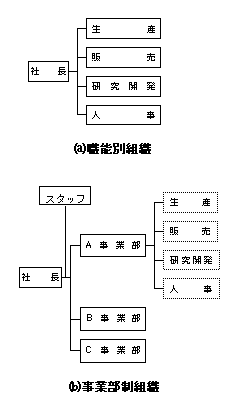
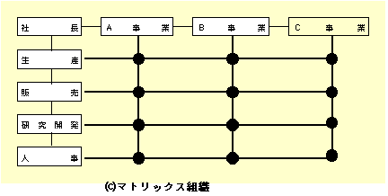

# 第12章 産業・組織の心理学
## 12-1 産業・組織の心理学とは
### 12-1-1 産業・組織心理学の定義
#### a. 産業・組織の定義
- **産業**とは：自然界から人間にとって必要な「もの」を採りだし〔農・林・漁・（鉱）業などの第1次産業）、それを人間の手で望ましいものに形成、変形し〔（鉱）・エネルギー・製造・建設業などの第2次産業〕、ある場所から他の場所へ移動し、時に応じて貯蔵し（運輸・流通業などの第3次産業）、それらのものやサービスに対して対価を払おうとする人の手に引き渡す（金融・不動産・サービス業、公務などの第3次産業）全過程のこと。
- **組織**とは：人が、1人では達成が困難なある目的を追求するために、なすべき仕事の性質を明確に分けて編成し、それぞれを構成員に担わせ（分業）、責任と権限を付与し、ときにそれを委譲することによって、最も効率的かつ効果的に協働できるように相互関係を設定（統制）した社会システムのこと。

##### 組織の構成の原則：
1. 目的共有の原則……目的・目標の規定と共有
2. 職務専門化の原則……同種の仕事はまとめ、相互に異なる機能を果たす
3. **権限委譲の原則**……最高の権限保有者の存在とその権限を各職務へ分配
4. 例外対処の原則……どの職務にも属さない事項の権限は上位者が保持
5. 権限・責任の対応原則……必要な権限は負担すべき責任に応じて付与される
6. **命令一元化の原則**……下位者への命令は直属の上司が行う
7. 管理限界の原則……管理監督する部下は多すぎない
8. 管理階層短縮の原則……組織階層はできるだけ少ない
9. 代替可能の原則……職務は能力を有する者なら誰でもそれに就ける
10. モティベーションとコミュニケーション維持増進の原則……組織が効果的に機能するよう協働と刀剣への意欲と円滑なコミュニケーションを促進する

**権限委譲の原則**とは：最高の権限保有者の存在とその権限を必要に応じて各職務へ分配（委譲）すること

**命令一元化の原則**とは：下位者への命令は、直属の上司が行うこと

##### 組織の形態の分類：
- 静態的組織
    - 集権的組織
        - [ライン組織](http://ja.wikipedia.org/wiki/%E3%83%A9%E3%82%A4%E3%83%B3%E7%B5%84%E7%B9%94)……最上位から最下位までがひとつの指揮系統で結ばれている
        - [ライン＆スタッフ組織](http://ja.wikipedia.org/wiki/%E3%83%A9%E3%82%A4%E3%83%B3%E3%82%A2%E3%83%B3%E3%83%89%E3%82%B9%E3%82%BF%E3%83%83%E3%83%95)……プロフィット部門（ライン）とノンプロフィット部門（スタッフ＝参謀）
        - **機能（職能）別**組織……職能別の部門化による組織
    - 分権的組織
        - **事業部制**組織……目的別の部門化（製品別・地理別）
        - カンパニー組織……各事業部の独立性を重視・社内分社化（ソニー）
        - 持株会社組織……統括と事業の分割（純粋持株は事業をもたない）
- 動態的組織
    - 
        - マトリクス組織……部門×事業部のマトリクス
        - **プロジェクト組織**……特定のプロジェクト専門のチームをつくる
        - **社内ベンチャー組織**……社内において新規事業を行う
        - ネットワーク組織……指示命令系統が相互依存型・緩やかな提携関係

※[経営組織論入門](http://homepage3.nifty.com/osumi/prof/soshiki/mokuji.html)

#### b. 産業・組織心理学の定義
### 12-1-2 産業・組織心理学の原点
#### a. 科学的管理法
- テイラー：「人間は**合理的**に経済利益を追求する**経済人**」と考え、**「作業標準（課業）」**という出来高制度で作業意欲を刺激しようとした。→**動機づけに「高賃金収入の獲得」が必要**とした。

#### b. 官僚制組織
- ウェーバー：定められた規則などの合理的・合法的な権威による組織である近代官僚制組織が「技術的に考えうる最も能率的な組織形態」であるとした
- 他の社会学者が指摘した逆機能：手段である規則が目的化・前例主義や事なかれ主義（責任回避）・**セクショナリズムや権威主義**の横行・文書の氾濫・決定の遅れ

#### c. 人間関係論（ホーソン実験）
- **アクション・リサーチ**：問題を**科学的**に解決するためのひとつのアプローチ。実験のための実験に終始するのではなく、実験には研究者、実務家、時にはクライエントにも参加してもらい、それらの協働により問題解決を行っていく。
- **メイヨー**（Mayo, G. E.）、**レスリスバーガー**（Roethlisberger, F. J.）らの**人間関係論**：組織で働く人間は、**社会的（相互関係的）な存在**であり、その**行動は非公式集団の規範によって規制**され、物理的・経済的条件以外に**感情的側面によって動機づけ**られる**（社会的動機づけ）**。
- ポイント：テイラーが科学的管理法で経済的欲求を満たすことで動機づけをしたのに対して、職場の人間関係を改善し社会的欲求を満足させることで動機づけを論じたのがレスリスバーガー。
- →**新人間関係学派**：人間は本来持っている**能力を最大限に発揮**することを望んでおり、そのためには**組織の意思決定に参加**できることが必要であるとした。（問題集9）
    - **アージリス**（Argyris, C.）『組織学習』：自己実現のための概念モデル
    - **マグレガー**（McGregor, D.）『企業の人間的側面』：X理論とY理論（まぐわい理論）
    - **リッカート**（Likert, R.）『経営と行動科学』：システムIV理論（システム4＝民主主義型＝｛課題志向＜人間関係志向｝がもっとも実績が高い）

※[産業における組織と心理学概説](http://jibun3.jugem.jp/?eid=8)
※[マグレガーとアージリスの人間観とは](http://www.soumunomori.com/column/article/atc-11541/)

## 12-2 産業・組織で働く人の行動
### 12-2-1 役割としての行動
#### a. 公的役割行動と非公的行動
1. 公的役割行動
2. 非公的行動との関係
    - 組織で働く人々は、人間である以上、その公的役割とは直接関係しない非公的（インフォーマル）な行動もしている

#### b. リーダーシップとフォロワーシップ
1. リーダーシップ論
    - **リーダーシップ（統率力）**とは：リーダーが、集団の目標達成に向けて、フォロワーに対して**影響力**を及ぼすこと
    - **ホワイトとリピット**（White, R. & Lippit, R.）の実験：
        - 専制的リーダー：**仕事の量は多い**が、**敵対的行動・不平不満・依存的行動が多い**
        - 民主的リーダー：仕事の量は多くないが、独創性・仲間意識・友好的発言・満足度が高い
        - 自由放任的リーダー：仕事の量質とも良くない・遊びが多い・まとまりがない・白けている
2. フォロワーシップ論

### 12-2-2 問題解決の行動
#### a. 問題解決行動
#### b. 意思決定行動
理想的には**規範主義モデル**（完全情報下での非限定合理性による決定）だが、これは不可能（これを「総覧的決定モデル」「最大化モデル」とよんでリンドブロムやサイモンは批判した）。よって**満足主義モデル**（努力のコストと決定の質とのバランスで満足水準を求める; サイモンのsatisficing）や**増分主義モデル**（不完全情報下で少しでもましになる決定をする; リンドブロムのincrementalism）がとられる。

- cf.
    - 山崎由香里, 2013, 「組織における意思決定に対する処方的アプローチの適用可能性」『成蹊大学経済学部論集』vol.44, no.2）
    - 野口悠紀雄；新村保子；内村広志；巾村和敏, 1977, 「予算における意思決定の分析」『経済分析』（経済企画庁経済研究所）vol.66

>（略）それに代わるもう1つの考え方は、意思決定者がある代替案をみつけたとき、それがどの程度好ましいものであるかについて彼はある「要求（aspiration）」をもっていると想定することである。彼は、選択に際し要求水準を満たすような代替案がみつかれば、ただちに探索活動をやめ、その代替案を採用する。私はこのような選択様式を「満足化（satisficing）」とよんだのである。このような考え方は、Lewinその他の研究者たちによる、要求水準についての、経験妥当な心理学的理論に基づいている。心理学研究が明らかにしてきたように、要求水準は静的なものではなく、変化する経験に相伴うかたちで上昇したり下降したりする傾向をもっているのである。多くの良い代替案をもたらしてくれる順境のときには、要求水準は上昇し、逆境のときには要求水準は下降する。

>　もしも探索費用をも考慮に入れたうえで要求水準に動的に適応するような選択をすれば、それは最適な選択と同値になるだろうということは、長期の均衡ではありうることである。しかし探索と満足化の理論について重要な点は、不可能なこと――最適化の手続きを実行すること――をせずに、妥当と思われる計算量ときわめて不完全な情報のもとで、選択が実際にどのように行われるかを示したことなのである。（Simon, H. A., 1979, "Rational Decision Making in Business Organizations", *The American Economic Review*, vol.69, no.4. = 「企業組織における合理的意思決定」『システムの科学　第3版』）

### 12-2-3 人間の判断の偏った傾向（バイアス）
#### a. 個人の判断バイアス（偏った傾向）
1. 認知的不協和の理論
    - **フェスティンガー**（Festinger, L.）の**認知的不協和の理論**（cognitive dissonance）：矛盾する認知を同時に抱えた場合、その不安定（不協和）な状態を解消するために、態度や行動を変更しようとする。
2. 確証バイアス：結論からそれに合う証拠を集める
3. 正常性バイアス
4. 合意推測バイアス
5. 紋切り型バイアス（ステレオタイプ）

#### b. 集団における判断のバイアス
1. 集団の魅力の要素：5つある
2. 同調バイアス：周りの人に合わせる
3. 社会的手抜き：責任意識が分散
4. リスキーシフトとコーシャスシフト（集団的浅慮）
5. 役割バイアス（ミルグラムやジンバルドの実験）

## 12-3 働く人の意欲と意識
### 12-3-1 働く意欲はどこから
- ワーク・モチベーションは：（問題集11-A）
    - **経済的動機づけ**
    - 社会的動機づけ
    - 自己実現的動機づけ

#### a. 人間の欲求から考える：欲求内容論
1. マズローの欲求階層理論（Maslow, A. H., 1954）
    - マズローは「人間は本来旺盛な労働意欲をもつ」と考えた。
    - マズロー理論は実証されず。そこで**アルダーファ**（Alderfer, C. P.）が修正・整理。「生存欲求」「関係欲求」「成長欲求」＝**ERG理論**。エビデンスあり。……【ポイント】2つ以上が同時に働くことはあるが、**重なり合わない**。
2. マグレガーのX理論Y理論（McGregor, D., 1960）
    - 旧来の考え方がX理論、望ましい考え方がY理論
    - Y理論： 働くことは人間の本性であり、条件しだいで満足感の源になる（まぐわい理論）
3. マクレランドの達成動機理論（McClelland, D. C., 1961）

Hierarchy of needs：覚え方（下から）**生理安全所承実**（せいりあんぜんしょしょうじつ）……ちなみに「愛」は「所属」

#### b. 欲求から行動へのメカニズムから考える：欲求メカニズム論
1. 内発的動機づけ・外発的動機づけ理論
    - **マーレイ**（Murray, E. J.）が分類：「外発的動機づけ」「内発的動機づけ」（内と外を回れい）
    - デシ（Deci, E.L.）：内発的動機づけに外から報酬が与えられると、内発的動機づけは弱まる。反面、外からの報酬が、内発的動機づけを誘発することもある。
    - マグレガーらが主張した内発的動機づけの例としては、提案制度、小集団活動、意思決定への参加。（問題集10-E）
2. 強化による学習理論
    - ハル（Hull, C.L.）：動因低減説
    - スキナー（Skinner, B.F.）：オペラント条件付け
3. [公正理論](http://www.geocities.jp/judgement_xp/KeyWord/EquityTheory.htm)
    - アダムス（Adams, J.S.）：インプットとアウトプットが他人と比べて「衡平」かどうかで動機づけられる。
4. 期待価値モデル
    - ブルーム（Vroom, V.H.）の期待理論をローラー（Lawler, III, E.E.）が修正した公式
    - M = Σ｛（E→P）×Σ［（P→O）×（V）］｝
        - M：動機づけの強さは
        - E→P：努力すれば業績に結びつくという期待確率に
        - P→O：業績を上げれば望む結果（報酬）が得られるという期待確率と
        - V：その結果そのものの魅力度の籍をさらに掛けたもの
        - 3つのどれかが0なら0になる

#### c. 規定要因論
1. **ハーズバーグ**の2要因説（Herzberg, F., 1966）（衛生的なハンバーグ）
    - **動機づけ要因**（満足の要因）：十分充足されれば満足感を増大させるが、充足されなくても満足感が減るだけで、不満足感が増加しない
    - **衛生要因**（不満足の要因）：十分充足されても不満足感が減るだけで、満足感が増加するわけではない
2. 職務特性論
    - ハックマンら（Hackman, J.R. & Oldham, G.R.）
        1. 多様性
        2. 完結性：最初から最後まで
        3. 有意義性：人に影響を与える
        4. 自律性：自由裁量や自己統制
        5. フィードバック：成果や評価が見える

#### d. 仕事意欲向上（動機づけ）策
1. 外発的動機づけ策
    - 「報酬」、すなわち「終身雇用」「年功賃金」から「能力主義」「成果主義」、「報奨制度」「提案制度」など。
2. 内発的動機づけ策
    1. **目標による管理**
        - **ドラッカー（Drucker, P.F.）**の**自己統制を通じての目標による管理**（Management by Objectives through Self Control）：仕事の目標を組織から従業員に一方的・強制的に押しつけるのではなく、組織の側の要求（目的）と従業員個人の要求（目的）を**マッチング**させ**自己管理で遂行**させることによって、個人の内発的動機づけを促進し、組織目標の達成をねらう。
    2. **キャリア開発プログラム**（career development program: CDP）
        - **CDP**：企業が長期的な人的資源管理の観点から、従業員個人に期待する価値と、その個人が自身のキャリア形成で目指す価値とを調和させるために、組織的、計画的、継続的に支援する。
    3. **メンタリング**（mentoring）
        - 上位の指導・支援者が、業務等に未熟な従業員に対して長期的にキャリア形成と心理・社会的側面での支援を行う。
    4. **コーチング**（coaching）
        - 従業員に**潜在的な能力**に気づかせ、それを問題解決の戦略や戦術に結びつけ、組織のなかでより効果的に行動できるよう支援する。積極的傾聴や**質問**などによって、従業員の自発的な気づきを促進し、内発的動機づけを図る。
    5. 小集団活動
        - **小集団活動**：この活動を通じて従業員の意見や考え方が経営に反映され、働きがいを生みだすことや、意見をたたかわせることによって**相互啓発**が促進されることなどが、従業員の内発的動機づけを促進する。
    6. 自己管理型作業システム
        - セル生産方式、一人屋台方式
    - 他に：提案制度、意思決定への参加（問題集11-B）

### 12-3-2 働く人の意識のさまざま
#### a. 個人の意識の次元
#### b. 調査データでみる働く人の意識
1. 働く目的は
2. 働く意欲は
3. 職場の上司・部下のコミュニケーションは
4. 新入社員のキャリア意識は

## 12-4 働く人をめぐる環境
### 12-4-1 現代日本における働く環境の問題
- 東京商工会議所（2009）**「中小企業経営者のための社会的責任（CSR）対応チェックシート」**
    - 第7項：従業員の心身の健康維持、十分な能力発揮によるモティベーション向上、差別や嫌がらせ禁止による働きやすい職場環境づくりの推奨。

### 12-4-2 人間性を重視する労働
#### a. 「労働の人間化・QWL」から「ディーセント・ワーク」へ
- ILO総会（1975年）**「労働をより人間的にすること」**→QWL
- ILO総会（1999年）**「ディーセント・ワーク」**（decent work）の推進
- 厚生労働省「ディーセント・ワーク」＝「働きがいのある人間らしい仕事」
    - 2010年閣議決定「新成長戦略」
        1. 働く機会がある
        2. 権利の保障
        3. ワーク・ライフ・バランス
        4. ダイバーシティ

#### b. ワーク・ライフ・バランス（work life balance）
- 内閣官房（2007年）**「仕事と生活の調和（ワーク・ライフ・バランス）憲章」**および「仕事と生活の調和増進のための行動指針」
    - 国民一人ひとりがやりがいや充実感を感じながら働き、仕事上の責任を果たすとともに、家庭や地域生活などにおいても、子育て期、中高年期といった人生の各段階に応じて多様な生き方が選択・実現できる社会を目指す。

#### c. ダイバーシティとインクルージョン（diversity and Inclusion: 多様性の受容）
- 外面の属性・内面の属性にかかわらずに（**ダイバーシティ**）、尊重して認め合う（インクルージョン）ことが求められているが、**ポジティブ・アクション**（積極的差別是正措置）の多くは女性や外国人を社員として雇用し、従業員の構成を性別や人種の点で多様化するにとどまっている。（→13「クオータ制」367）
- 2002年日経連（経団連）『原点回帰ーーダイバーシティ・マネジメントの方向性』
    - ダイバーシティ・マネジメントとは：「従来の企業内や社会におけるスタンダードにとらわれず、多様な属性（性別、年齢、国籍など）や価値・発想を取り入れることで、ビジネス環境の変化に迅速かつ柔軟に対応し、企業の成長と個人のしあわせにつなげようとする戦略」

### 12-4-3 人間性を重視した職場環境条件
#### a. 仕事自体に備えるべき条件
#### b. 組織運営として備えるべき条件
#### c. 労働条件として基本的に備えるべき条件

### 12-4-4 産業カウンセラーの働く環境へのかかわり
#### a. コミュニティ心理学から学ぶ
- 問題を抱えた個人に対する責任は、多様な専門家と組織の管理者などの**非専門家**的協力者とが連携したネットワーク（コミュニティ）で負う
- 問題の疾病性（illness）ではなく事例性（caseness）を重視
- 弱い面の修復よりは強い面を支え強化する**成長モデル**を志向
- 待つのではなく生活している場に出ていく

##### **コミュニティ・アプローチ**の**介入**のプロセス：（問題集9）
1. 問題の気づき
2. 介入計画の立案
3. 介入の実行
4. 結果の評価
5. 理論化

#### b. 産業・組織にかかわる産業カウンセラーの役割
1. **コンサルタント**
    - ：問題を抱えた人に対してではなく、**問題を抱えた人の問題解決に責任をもつ組織の担当者などに対して**、その効果的な解決に必要な専門的な知識や技術を提供する役割。
2. **コーディネーター（オーガナイザー）**
    - ：関係する人々や機関との関係を調整したり、新たに構築する役割。
3. **ファシリテーター（インストラクター）**
    - ：問題を抱えた集団や組織に対して直接的に働きかける役割。
        - オフサイトミーティングの促進者として「通訳」「交通整理係」「仲人」

